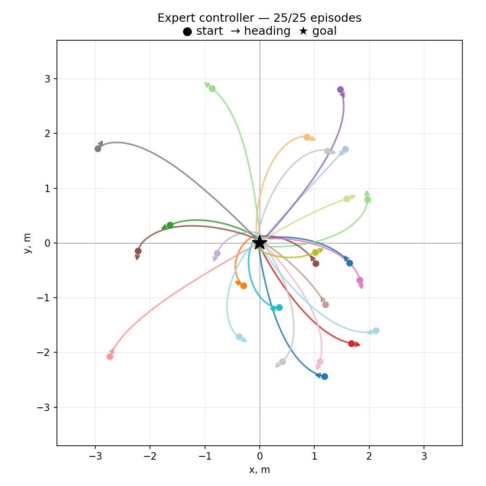
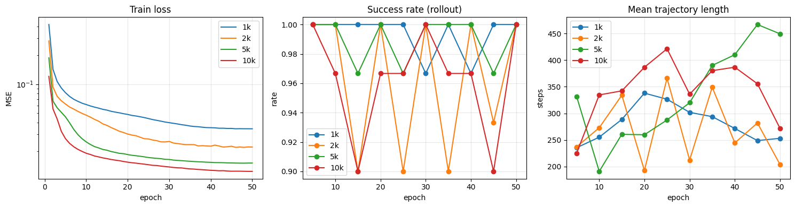
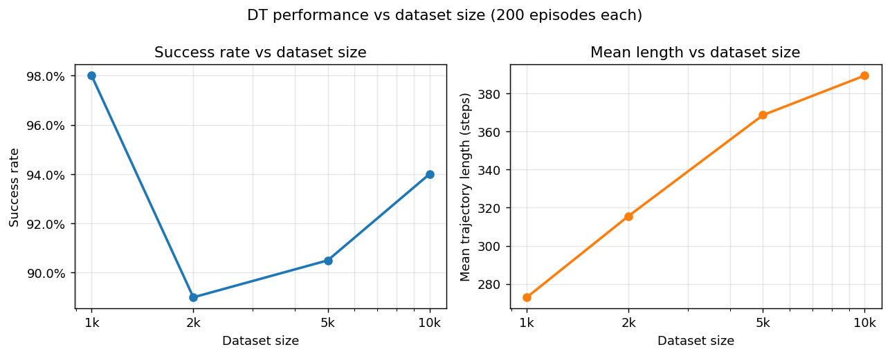
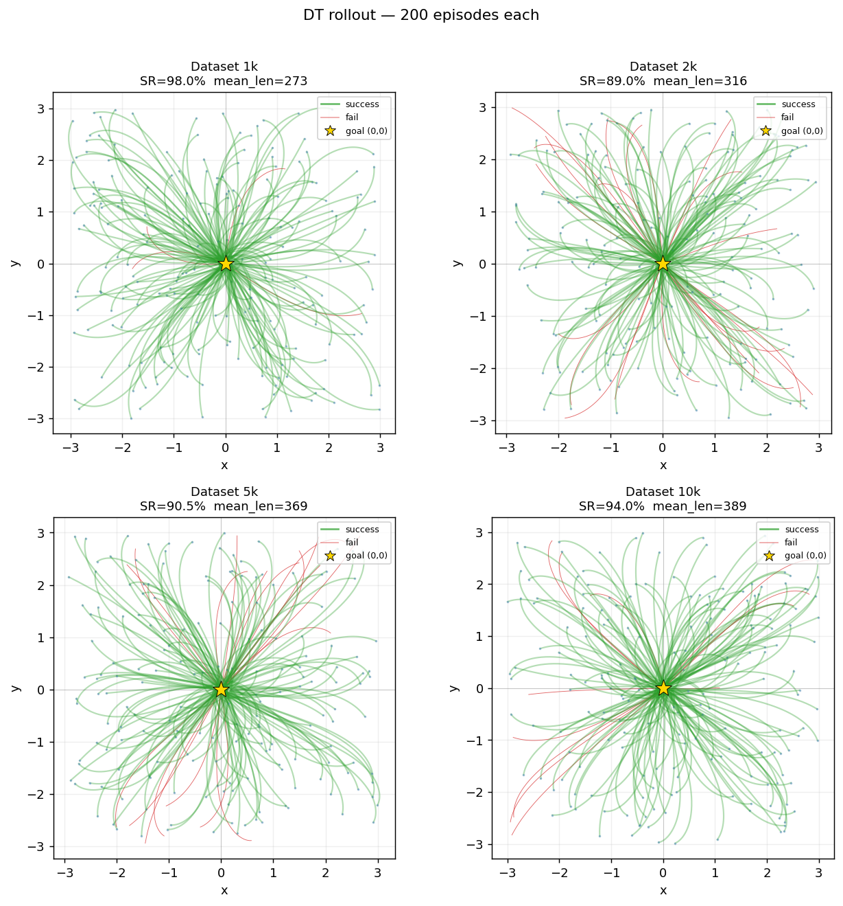
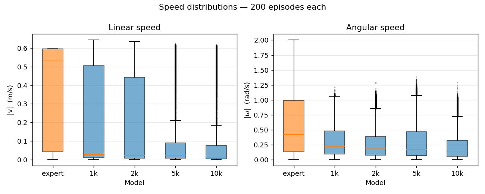

# Decision Transformer for Differential-Drive Robot Navigation

Imitation learning approach to robot navigation: a Decision Transformer trained on expert demonstrations steers a differential-drive robot from any random starting pose to the origin `(0, 0, θ=0)`.

---

## Problem

**Robot:** differential-drive (unicycle kinematics)

```
x_new     = x + cos(θ) · v · dt
y_new     = y + sin(θ) · v · dt
θ_new     = θ + ω · dt
```

**Goal:** reach `(x, y, θ) = (0, 0, 0)` from a random start in `[-3, 3]² × [-π, π]`.

| | Space |
|---|---|
| **Observation** | `[dist, cos(α), sin(α)]` — distance to goal and heading error (periodic encoding) |
| **Action** | `[v, ω]` — linear and angular velocity |
| **Done** | `dist < 0.05` and `\|θ\| < 0.1 rad` |

The observation uses `(cos α, sin α)` instead of raw angle α to avoid the discontinuity at ±π.

**Why this problem is non-trivial.** The differential-drive robot is a nonholonomic system — it cannot move sideways, only forward/backward and rotate. By Brockett's necessary condition (1983), no smooth time-invariant feedback controller can asymptotically stabilize such a system to a point. This is a fundamental topological obstruction, not an engineering limitation: the robot is globally controllable (any pose is reachable), yet classical smooth optimal control cannot stabilize it to the origin without resorting to time-varying or hybrid strategies.

---

## Expert Controller

A geometric controller used to collect demonstrations. It does not use a finite-state machine — instead it computes actions directly from the position vector **r** = (x, y) and heading **p** = (cos θ, sin θ):

```python
cross  = r × p          # signed angle between r and p
rp     = r · p          # projection of r onto heading

v     = -k_v  * rp / |r|              # forward when facing goal
omega = -k_ω  * sign(rp) * cross / |r|  # steer toward goal
```

The sign of `rp` tells the controller whether to go forward or backward, so the robot always takes the shorter path. Near the goal (`dist < 0.015`) it switches to pure theta-alignment.

Expert success rate: **≈ 99%** on 1 000 random episodes.



---

## Decision Transformer

Standard DT architecture with the `[RTG, obs, act]` token interleaving.

| Hyperparameter | Value |
|---|---|
| Observation dim | 3 |
| Action dim | 2 |
| Context length K | 20 |
| Embedding dim | 64 |
| Transformer layers | 3 |
| Attention heads | 4 |
| Desired RTG (normalized) | −0.4 |

The model is trained with supervised MSE loss on sequences sampled from recorded expert trajectories.

---

## Results

Models trained on datasets of different sizes, evaluated over 200 rollouts each (`tests/eval_dt.ipynb`).
Evaluation uses relaxed thresholds: `dist < 0.2` and `|θ| < 0.3 rad` (vs. `0.05` / `0.1` during training).

> **Note:** the training monitor (`results.json`) reports 100% SR for all models because training-time evaluation uses only 30 episodes — too few to distinguish 92% from 100%. The 200-episode evaluation below gives the real picture.

| Dataset | Train loss (final) | Success Rate | Mean length | Failed |
|---|---|---|---|---|
| Expert       | —      | **100%** |   134 |  0 |
| 1 k episodes | 0.0343 |  **98%** |   273 |  4 |
| 2 k episodes | 0.0221 |    89%   |   316 | 22 |
| 5 k episodes | 0.0151 |  90.5%   |   369 | 19 |
| 10 k episodes | 0.0124 |   94%  |   389 | 12 |

### Non-monotonic effect: drop then recovery

The best result is achieved by the **1k model** — it matches expert success rate despite seeing 10× fewer demonstrations. Performance then drops at 2k–5k and gradually recovers at 10k.

**Hypothesis.** All datasets are prefixes of the same 10k collection. The 1k subset contains shorter, more consistent trajectories (mean length ~178 steps). The DT model (embed_dim=64, 3 layers) is small enough that 1k provides a clean, low-variance training signal it can fully absorb. As the dataset grows to 2k–5k, the distribution widens — longer and more varied trajectories enter — and the model's capacity becomes a bottleneck: it can no longer memorize all patterns and the policy becomes noisier. At 10k the volume of data is large enough to average out some of that noise, giving a partial recovery. The monotonically growing mean trajectory length (263 → 367 steps vs. expert's ~182) supports this: larger-dataset models produce more wandering paths, consistent with a less precise policy.

### Training loss



Loss decreases steadily across epochs. Notably, the agent's mean speed on training-time rollouts increases as training progresses — the model learns to commit to more decisive actions rather than averaging toward zero velocity.

### Performance vs dataset size



The 1k model achieves the best success rate, outperforming models trained on larger datasets. Performance drops at 2k–5k before partially recovering at 10k — a non-monotonic effect discussed above.

### Trajectories — Expert vs Decision Transformer



Trajectories are geometrically correct and visually similar to the expert: the robot curves toward the origin and aligns its heading before stopping. Failed episodes (red) are rare and mostly stall near the boundary rather than diverging.

### Action distribution — Expert vs DT



The DT moves considerably slower than the expert (mean episode length 2–3× longer), yet the trajectory shapes are geometrically correct — the robot still curves toward the origin and aligns its heading. The model learned the right structure of the policy but outputs more conservative, low-magnitude actions, likely because the MSE loss pulls predictions toward the mean of the training distribution.

---

## Repository Structure

```
.
├── sim/
│   ├── env.py            # DiffDriveEnv — numba-accelerated kinematics
│   ├── expert.py         # Geometric expert controller (numba JIT)
│   ├── generate_data.py  # Collect expert trajectories → data/
│   └── test_expert.py    # Quick sanity check (5 episodes)
├── dt/
│   ├── model.py          # DecisionTransformer (nn.Module)
│   ├── dataset.py        # SequenceDataset — HDF5 + RTG preprocessing
│   └── evaluate.py       # Rollout evaluation
├── checkpoints/          # Saved model weights (*.pt, not tracked)
├── data/                 # Generated datasets (*.hdf5, not tracked)
├── figures/              # Plots
├── tests/
│   ├── test_generation.ipynb    # Generate expert datasets → data/
│   ├── train_dt.ipynb           # Train DT on all four datasets
│   ├── eval_dt.ipynb            # Batched rollout evaluation + plots
│   ├── visualize_expert.ipynb   # Expert trajectory visualization
│   └── monitor.ipynb            # Training monitor (notebook version)
├── scripts/
│   ├── monitor.py        # Live training monitor (reads results.json)
│   └── plot_expert.py    # Generate expert trajectory figure
├── results.json          # Training history
├── requirements.txt
└── environment.yml
```

---

## How to Run

### 1. Install dependencies

```bash
conda env create -f environment.yml
conda activate dl_project
```

### 2. Generate expert dataset

Open `tests/test_generation.ipynb` and run all cells.

Saves `data/dataset_{1k,2k,5k,10k}.h5`.

### 3. Train

Open `tests/train_dt.ipynb` and run all cells.

Trains four models sequentially, saves best checkpoints to `checkpoints/`, logs to `results.json`.

### 4. Evaluate

Open `tests/eval_dt.ipynb` and run all cells.

Runs 200-episode batched rollout for each model and the expert, saves plots to `figures/`.

### 5. Monitor training (optional, while training runs)

```bash
python scripts/monitor.py
```

---

## Dependencies

- Python 3.10
- PyTorch
- NumPy
- Numba
- h5py
- matplotlib
- tqdm

See `environment.yml` for the full environment.
